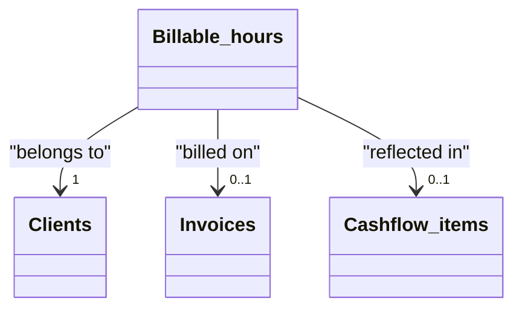

# Billable hours

[Open in Airtable](https://airtable.com/appAeUFSMOuOVDfCV/tblBhPqOGFIV86qsb)

## Purpose
Granular work‑log ledger. Each record captures *what* task was done, *for whom*, *when*, *how long*, and the monetary value to be billed. These entries roll up into invoices and feed revenue analytics & cash‑flow.

<ScrollableScreenshot src="/tables/billable-hours.png" />

## Fields

| Type                                      | Field                          | Key Options / Formula                                                                                       | Notes                                                         |
| ----------------------------------------- | ------------------------------ | ----------------------------------------------------------------------------------------------------------- | ------------------------------------------------------------- |
| <FieldIcon type="singleLineText" />       | **Task**                       | —                                                                                                           | Short description (“API integration”, “Sprint planning meeting”). |
| <FieldIcon type="date" />                 | **Date**                       | Format `l`                                                                                                  | Defaults to today; drives weekly / monthly reporting.         |
| <FieldIcon type="duration" />             | **Hours**                      | Format `h:mm`                                                                                               | Airtable stores seconds under the hood.                      |
| <FieldIcon type="multipleSelects" />      | **Tags**                       | ▫︎ Meeting ▫︎ Development ▫︎ Research                                                                        | Categorise time for later analysis; add more tags freely.     |
| <FieldIcon type="multipleRecordLinks" />  | **Client**                     | —                                                                                                           | Must be set first – triggers default rate & currency lookups. |
| <FieldIcon type="currency" />             | **Hourly rate (snapshot)**     | —                                                                                                           | Copied once from Client on record creation; changing the Client’s rate later won’t update old logs. |
| <FieldIcon type="singleSelect" />         | **Currency**                   | ▫︎ EUR ▫︎ CZK ▫︎ USD                                                                                          | Also copied from Client at creation.                         |
| <FieldIcon type="formula" />              | **Billable**                   | `{Hourly rate} * ({Hours}/3600)`                                                                            | Shows value in native currency.                              |
| <FieldIcon type="formula" />              | **Billable (USD)**             | 

Formula
`IF({Currency}='EUR',{Billable}*1.136,IF({Currency}='USD',{Billable},BLANK()))`
 | Quick FX conversion for consolidated P&L.                   |
| <FieldIcon type="multipleRecordLinks" />  | **Invoice**                    | —                                                                                                           | Attach the entry once you raise an invoice.                  |
| <FieldIcon type="multipleLookupValues" /> | **Invoice Status**             | from Invoice → **Status**                                                                                   | Propagates Draft/Sent/Paid/Overdue.                          |
| <FieldIcon type="formula" />              | **Paid**                       | `IF({Invoice Status}='Paid', TRUE(), FALSE())`                                                              | Tick auto-updates when invoice is paid.                      |
| <FieldIcon type="multilineText" />        | **Details**                    | —                                                                                                           | Meeting notes / JIRA ticket link etc.                        |
| <FieldIcon type="multipleRecordLinks" />  | **Cashflow items**             | —                                                                                                           | Back-references for cash-flow roll-up.                       |
| <FieldIcon type="multipleLookupValues" /> | **Hourly rate (from Client)**  | Lookup from Client → **Hourly rate**                                                                        | For auditing: shows current value on the Client record.      |
| <FieldIcon type="multipleLookupValues" /> | **Currency (from Client)**     | Lookup from Client → **Currency**                                                                           | For auditing: shows current value on the Client record.      |

## Relationships

- **[Clients](https://airtable.com/appAeUFSMOuOVDfCV/tblLdpbp52Mhjog08)** (linked via *Client*)
- **[Invoices](https://airtable.com/appAeUFSMOuOVDfCV/tblTqyv2AcNTQJPje)** (linked via *Invoice*)
- **[Billed projects](https://airtable.com/appAeUFSMOuOVDfCV/tbl0oXRRiB7Fj1vEl)** (linked via *Billed projects*)

## Gotchas

* **Set the Client first** → this snapshots rate & currency. Editing them later does **not** cascade.
* **Duration unit**: Airtable stores seconds. Formula divides by 3600 to convert to hours; make sure the *Hours* format remains `h:mm`.
* **Tag diligently** – Categories power utilisation dashboards.
* **FX rate is fixed** (1 EUR ≈ 1.136 USD) in formula; update periodically or switch to live rates if accuracy matters.
* **One invoice link max** – If you need to split hours across multiple invoices, duplicate the record with adjusted durations.
* Deleting an invoice will **not** delete hours; they revert to "unbilled" status.

## Calculated & AI fields
The **Billable** field automatically calculates the monetary value by multiplying the hourly rate snapshot by the duration in hours. The **Billable (USD)** field provides currency conversion for consolidated reporting, while the **Paid** checkbox dynamically updates based on the linked invoice's payment status.
