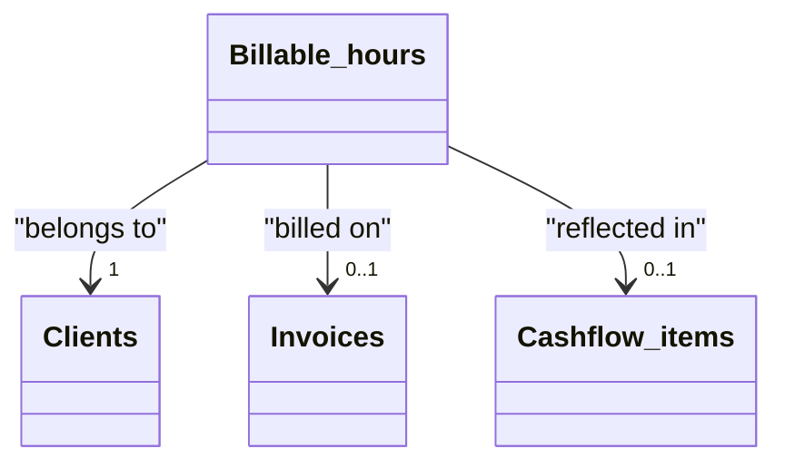

# Billable hours

[Open in Airtable](https://airtable.com/appAeUFSMOuOVDfCV/tblBhPqOGFIV86qsb)

## Purpose
Granular work‑log ledger. Each record captures *what* task was done, *for whom*, *when*, *how long*, and the monetary value to be billed. These entries roll up into invoices and feed revenue analytics & cash‑flow.

## Fields

| Field | Type | Key Options / Formula | Notes |
| ----- | ---- | --------------------- | ----- |
| **Task** | text (primary) | — | Short description ("API integration", "Sprint planning meeting"). |
| **Date** | date | Format `l` | Defaults to today; drives weekly / monthly reporting. |
| **Hours** | duration | Format `h:mm` | Airtable stores seconds under the hood. |
| **Tags** | multi‑select ▫︎ Meeting ▫︎ Development ▫︎ Research | Categorise time for later analysis. Add more tags freely. | |
| **Client** | link → [**Clients**](https://airtable.com/appAeUFSMOuOVDfCV/tblLdpbp52Mhjog08) | Single link | Must be set first – triggers default rate & currency lookups. |
| **Hourly rate (snapshot)** | currency | Copied once from Client on record creation | Changing the Client's rate later won't update old logs. |
| **Currency** | single‑select ▫︎ EUR ▫︎ CZK ▫︎ USD | Also copied from Client at creation. | |
| **Billable** | formula | `{Hourly rate} * ({Hours}/3600)` | Shows value in native currency. |
| **Billable (USD)** | formula | 

Formula
`IF({Currency}='EUR',{Billable}*1.136,IF({Currency}='USD',{Billable},BLANK()))`
 | Quick FX conversion for consolidated P&L. |
| **Invoice** | link → [**Invoices**](https://airtable.com/appAeUFSMOuOVDfCV/tblTqyv2AcNTQJPje) | Single link | Attach the entry once you raise an invoice. |
| **Invoice Status** | lookup | from Invoice → **Status** | Propagates Draft/Sent/Paid/Overdue. |
| **Paid** | formula → checkbox | `IF({Invoice Status}='Paid', TRUE(), FALSE())` | Tick auto‑updates when invoice is paid. |
| **Details** | long text | — | Meeting notes / JIRA ticket link etc. |
| **Cashflow items** | link → [**Cashflow items**](https://airtable.com/appAeUFSMOuOVDfCV/tblZhFXFFYHJsmCVn) | Multiple links | Back‑references for cash‑flow roll‑up. |
| **Hourly rate (from Client)** | lookup | from Client → **Hourly rate** | For auditing: shows current values on the Client record. |
| **Currency (from Client)** | lookup | from Client → **Currency** | For auditing: shows current values on the Client record. |

## Relationships

- **[Clients](https://airtable.com/appAeUFSMOuOVDfCV/tblLdpbp52Mhjog08)** (linked via *Client*)
- **[Invoices](https://airtable.com/appAeUFSMOuOVDfCV/tblTqyv2AcNTQJPje)** (linked via *Invoice*)
- **[Billed projects](https://airtable.com/appAeUFSMOuOVDfCV/tbl0oXRRiB7Fj1vEl)** (linked via *Billed projects*)

## Gotchas

* **Set the Client first** → this snapshots rate & currency. Editing them later does **not** cascade.
* **Duration unit**: Airtable stores seconds. Formula divides by 3600 to convert to hours; make sure the *Hours* format remains `h:mm`.
* **Tag diligently** – Categories power utilisation dashboards.
* **FX rate is fixed** (1 EUR ≈ 1.136 USD) in formula; update periodically or switch to live rates if accuracy matters.
* **One invoice link max** – If you need to split hours across multiple invoices, duplicate the record with adjusted durations.
* Deleting an invoice will **not** delete hours; they revert to "unbilled" status.

## Calculated & AI fields
The **Billable** field automatically calculates the monetary value by multiplying the hourly rate snapshot by the duration in hours. The **Billable (USD)** field provides currency conversion for consolidated reporting, while the **Paid** checkbox dynamically updates based on the linked invoice's payment status.