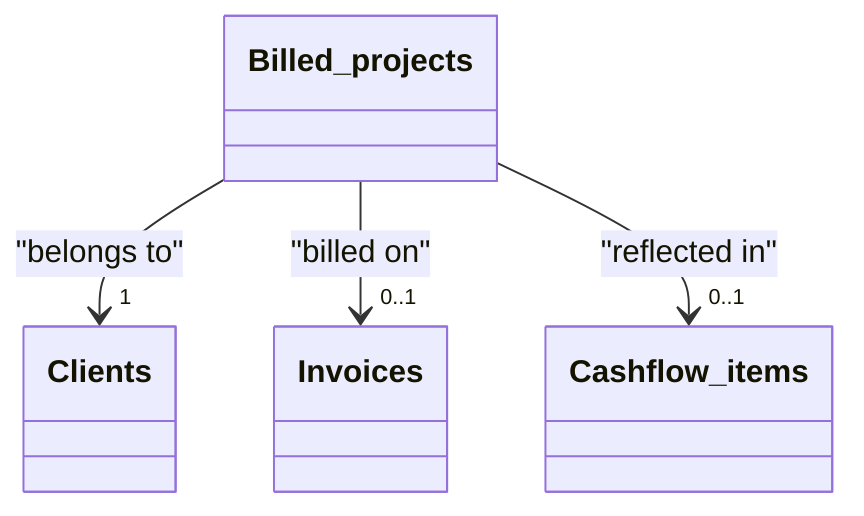

# Billed projects

[Open in Airtable](https://airtable.com/appAeUFSMOuOVDfCV/tbl0oXRRiB7Fj1vEl)

## Purpose
Tracks fixed‑scope deliverables (websites, audits, research reports) that are billed at a lump‑sum price rather than hourly. Projects can be attached to invoices, rolled into cash‑flow, and analysed alongside time‑based work.

## Fields

| Field | Type | Key Options / Formula | Notes |
| ----- | ---- | --------------------- | ----- |
| **Name** | text (primary) | — | Short project slug. Combine client + deliverable if helpful ("ACME – SEO audit"). |
| **Delivery Date** | date | Format `l` | Marks completion milestone; used for revenue recognition & cash‑flow timing. |
| **Price** | currency | Precision 0 | Enter in **native currency** below. |
| **Currency** | single‑select ▫︎ EUR ▫︎ CZK ▫︎ USD | Must match the currency used in *Price*. | |
| **Price (USD)** | formula | 

Formula
`IF({Currency}='EUR',{Price}*1.136,IF({Currency}='USD',{Price},BLANK()))`
 | Converts into USD for consolidated reporting. |
| **Client** | link → [**Clients**](https://airtable.com/appAeUFSMOuOVDfCV/tblLdpbp52Mhjog08) | Single link | Drives currency defaults via lookup; used for grouping dashboards. |
| **Invoice** | link → [**Invoices**](https://airtable.com/appAeUFSMOuOVDfCV/tblTqyv2AcNTQJPje) | Single link | Attach once the project is billed. |
| **Invoice Status** | lookup | from Invoice → **Status** | Reflects billing state (Draft / Sent / Paid / Overdue). |
| **Paid** | formula → checkbox | 

Formula
`IF(ARRAYJOIN({Invoice Status}, '')='Paid', TRUE(), FALSE())`
 | Auto‑checks when linked invoice is paid. |
| **Currency (from Client)** | lookup | from Client → **Currency** | Shows the client's default currency for QA. |
| **Currency (from Invoice)** | lookup | from Invoice → **Currency** | Ensures invoice uses same money unit. |
| **Cashflow items** | link → [**Cashflow items**](https://airtable.com/appAeUFSMOuOVDfCV/tblZhFXFFYHJsmCVn) | Multiple links | Auto‑generated via automation after invoice approval. |

## Relationships

- **[Clients](https://airtable.com/appAeUFSMOuOVDfCV/tblLdpbp52Mhjog08)** (linked via *Client*)
- **[Invoices](https://airtable.com/appAeUFSMOuOVDfCV/tblTqyv2AcNTQJPje)** (linked via *Invoice*)
- **[Cashflow items](https://airtable.com/appAeUFSMOuOVDfCV/tblZhFXFFYHJsmCVn)** (linked via *Cashflow items*)

## Gotchas

* **Enter Price in native currency**; *Price (USD)* is derived, do **not** overwrite it.
* **Currency mismatch** between Project and Invoice will break rolled‑up totals—ensure they're identical before sending.
* Linking an Invoice late will retro‑update **Invoice Status** & **Paid**; dashboards refresh within seconds.
* If a project is split across multiple milestone invoices, duplicate the record or create child line‑items elsewhere; this table assumes one‑invoice per project.
* FX rate (1 EUR → 1.136 USD) is **static** in the formula. Update periodically or switch to live rates.
* Deleting an invoice will unlink the project (but does not delete it) → project reverts to "unbilled".

## Calculated & AI fields
The **Price (USD)** field automatically converts project values to USD using fixed exchange rates for consolidated reporting. The **Paid** checkbox dynamically updates based on the linked invoice's payment status, providing real-time visibility into project payment completion.