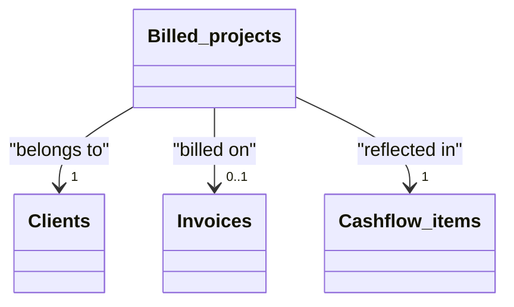

# Billed projects

[Open in Airtable](https://airtable.com/appAeUFSMOuOVDfCV/tbl0oXRRiB7Fj1vEl)

## Purpose
Tracks fixed‑scope deliverables (websites, audits, research reports) that are billed at a lump‑sum price rather than hourly. Projects can be attached to invoices, rolled into cash‑flow, and analysed alongside time‑based work.

<!-- <ScrollableScreenshot src="/tables/billable-projects.png" /> -->
<iframe class="airtable-embed" src="https://airtable.com/embed/appAeUFSMOuOVDfCV/shrVl1NHBSmC2zd1Q" frameborder="0" onmousewheel="" width="100%" height="260" style="background: transparent; border: 1px solid #ccc;"></iframe>

## Fields

| Type                                      | Field                         | Key Options / Formula                                                                                          | Notes                                                            |
| ----------------------------------------- | ----------------------------- | -------------------------------------------------------------------------------------------------------------- | ---------------------------------------------------------------- |
| <FieldIcon type="singleLineText" />       | **Name**                      | —                                                                                                              | Short project slug. Combine client + deliverable if helpful (“ACME – SEO audit”). |
| <FieldIcon type="date" />                 | **Delivery Date**             | Format `l`                                                                                                     | Marks completion milestone; used for revenue recognition & cash-flow timing. |
| <FieldIcon type="currency" />             | **Price**                     | Precision 0                                                                                                    | Enter in **native currency** below.                              |
| <FieldIcon type="singleSelect" />         | **Currency**                  | ▫︎ EUR ▫︎ CZK ▫︎ USD                                                                                            | Must match the currency used in *Price*.                        |
| <FieldIcon type="formula" />              | **Price (USD)**               | 

Formula
`IF({Currency}='EUR',{Price}*1.136,IF({Currency}='USD',{Price},BLANK()))`
 | Converts into USD for consolidated reporting.                    |
| <FieldIcon type="multipleRecordLinks" />  | **Client**                    | —                                                                                                              | Drives currency defaults via lookup; used for grouping dashboards. |
| <FieldIcon type="multipleRecordLinks" />  | **Invoice**                   | —                                                                                                              | Attach once the project is billed.                              |
| <FieldIcon type="multipleLookupValues" /> | **Invoice Status**            | from Invoice → **Status**                                                                                      | Reflects billing state (Draft / Sent / Paid / Overdue).           |
| <FieldIcon type="formula" />              | **Paid**                      | 

Formula
`IF(ARRAYJOIN({Invoice Status}, '')='Paid', TRUE(), FALSE())`
        | Auto-checks when linked invoice is paid.                        |
| <FieldIcon type="multipleLookupValues" /> | **Currency (from Client)**    | Lookup from Client → **Currency**                                                                              | Shows the client's default currency for QA.                     |
| <FieldIcon type="multipleLookupValues" /> | **Currency (from Invoice)**   | Lookup from Invoice → **Currency**                                                                             | Ensures invoice uses same money unit.                           |
| <FieldIcon type="multipleRecordLinks" />  | **Cashflow items**            | —                                                                                                              | Auto-generated via automation after invoice approval.           |

## Relationships

- **[Clients](https://airtable.com/appAeUFSMOuOVDfCV/tblLdpbp52Mhjog08)** (linked via *Client*)
- **[Invoices](https://airtable.com/appAeUFSMOuOVDfCV/tblTqyv2AcNTQJPje)** (linked via *Invoice*)
- **[Cashflow items](https://airtable.com/appAeUFSMOuOVDfCV/tblZhFXFFYHJsmCVn)** (linked via *Cashflow items*)

## Gotchas

* **Enter Price in native currency**; *Price (USD)* is derived, do **not** overwrite it.
* **Currency mismatch** between Project and Invoice will break rolled‑up totals—ensure they're identical before sending.
* If a project is split across multiple milestone invoices, duplicate the record or create child line‑items elsewhere; this table assumes one‑invoice per project.
* FX rate (1 EUR → 1.136 USD) is **static** in the formula. Update periodically or switch to live rates.
* Deleting an invoice will unlink the project (but does not delete it) → project reverts to "unbilled".

## Calculated & AI fields
The **Price (USD)** field automatically converts project values to USD using fixed exchange rates for consolidated reporting. The **Paid** checkbox dynamically updates based on the linked invoice's payment status, providing real-time visibility into project payment completion.
