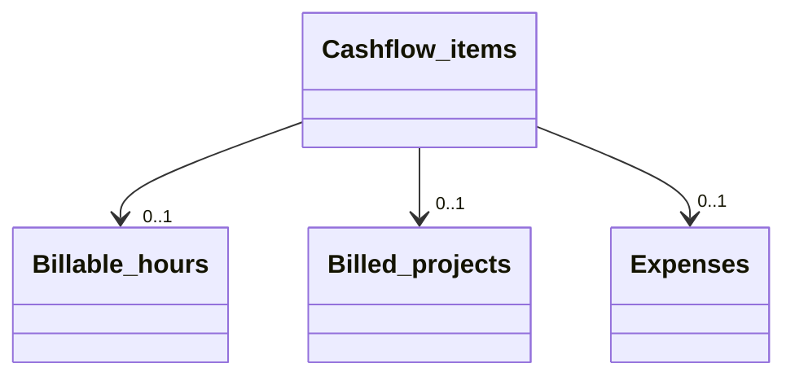

# Cashflow items

[Open in Airtable](https://airtable.com/appAeUFSMOuOVDfCV/tblZhFXFFYHJsmCVn)

## Purpose
Unified ledger that normalises **Hours**, **Projects**, and **Expenses** into a single table for monthly cash‑flow and P&L dashboards. Each record references exactly *one* underlying source (billable hours entry, fixed‑price project, or expense) and converts it to a common sign (+ revenue / – cost) and currency field.

<ScrollableScreenshot src="/tables/cashflow-items.png" />

## Fields

| Type                                    | Field                        | Key Options / Formula                                                                                                                   | Notes                                                            |
| --------------------------------------- | ---------------------------- | ---------------------------------------------------------------------------------------------------------------------------------------- | ---------------------------------------------------------------- |
| <FieldIcon type="formula" />            | **Name**                     | 

Formula
`IF(Billable hours, Billable hours, IF(Billed projects, Billed projects, Expense))`
         | Mirrors the linked record’s name for quick recognition.          |
| <FieldIcon type="formula" />            | **Type**                     | 

Formula
`IF(Billable hours, 'Hours', IF(Billed projects, 'Project', 'Expense'))`
                    | Evaluates which link field is populated; drives colour coding.   |
| <FieldIcon type="singleLineText" />     | **Created By**               | —                                                                                                                                       | Audit trail for manual adds.                                     |
| <FieldIcon type="multipleRecordLinks" />| **Billable hours**           | —                                                                                                                                       | Positive revenue inflow.                                         |
| <FieldIcon type="multipleRecordLinks" />| **Billed projects**          | —                                                                                                                                       | Positive lump-sum inflow.                                        |
| <FieldIcon type="multipleRecordLinks" />| **Expense**                  | —                                                                                                                                       | Negative outflow.                                                |
| <FieldIcon type="formula" />            | **Date**                     | 

Formula
`IF({Date (from Hours)}, {Date (from Hours)}, IF({Date (from Project)}, {Date (from Project)}, {Date (from Expense)}))`
 | Picks whichever linked record provides a date.                   |
| <FieldIcon type="formula" />            | **Currency**                 | 

Formula
`IF({Currency (from Hours)}, {Currency (from Hours)}, IF({Currency (from Project)}, {Currency (from Project)}, 'USD'))`
         | Chooses currency from Hours or Project link; defaults USD.       |
| <FieldIcon type="formula" />            | **Amount**                   | 

Formula
`IF(Expense, {Amount (from Expense)} * -1, IF({Billable hours}, {Billable (USD)}, {Price (USD)}))`
  | Ensures expenses show as negative; revenue as positive (USD).    |
| <FieldIcon type="formula" />            | **Months ago**               | 

Formula
`FLOOR(DATETIME_DIFF(TODAY(), Date, 'month'))`
                                              | Facilitates cohort / trailing-12-month charts.                   |
| <FieldIcon type="formula" />            | **Client**                   | 

Formula
`IF({Client (from Hours)}, {Client (from Hours)}, IF({Client (from Project)}, {Client (from Project)}, {Client (from Expense)}))`
 | Cascades client name from whichever link field is present.       |
| <FieldIcon type="multipleLookupValues" /> | **Date (from Hours)**       | —                                                                                                                                       | Hidden lookup feeding canonical Date formula.                    |
| <FieldIcon type="multipleLookupValues" /> | **Date (from Project)**     | —                                                                                                                                       | Hidden lookup from Billed projects → Delivery Date.              |
| <FieldIcon type="multipleLookupValues" /> | **Date (from Expense)**     | —                                                                                                                                       | Hidden lookup from Expense → Date.                               |
| <FieldIcon type="multipleLookupValues" /> | **Billable (USD)**          | —                                                                                                                                       | Hidden lookup feeding canonical Amount formula.                  |
| <FieldIcon type="multipleLookupValues" /> | **Price (USD)**             | —                                                                                                                                       | Hidden lookup feeding canonical Amount formula.                  |
| <FieldIcon type="multipleLookupValues" /> | **Amount (from Expense)**   | —                                                                                                                                       | Hidden lookup feeding canonical Amount formula.                  |
| <FieldIcon type="multipleLookupValues" /> | **Currency (from Hours)**   | —                                                                                                                                       | Hidden lookup feeding canonical Currency formula.                |
| <FieldIcon type="multipleLookupValues" /> | **Currency (from Project)** | —                                                                                                                                       | Hidden lookup feeding canonical Currency formula.                |
| <FieldIcon type="multipleLookupValues" /> | **Client (from Hours)**     | —                                                                                                                                       | Hidden lookup feeding canonical Client formula.                  |
| <FieldIcon type="multipleLookupValues" /> | **Client (from Project)**   | —                                                                                                                                       | Hidden lookup feeding canonical Client formula.                  |
| <FieldIcon type="multipleLookupValues" /> | **Client (from Expense)**   | —                                                                                                                                       | Hidden lookup feeding canonical Client formula.                  |

## Relationships

- **[Billable hours](https://airtable.com/appAeUFSMOuOVDfCV/tblBhPqOGFIV86qsb)** (linked via *Billable hours*)
- **[Billed projects](https://airtable.com/appAeUFSMOuOVDfCV/tbl0oXRRiB7Fj1vEl)** (linked via *Billed projects*)
- **[Expenses](https://airtable.com/appAeUFSMOuOVDfCV/tbl4rs8m2aGUcyH90)** (linked via *Expense*)

## Gotchas

* **Exactly one link**: hours *or* project *or* expense—never more than one. Use an automation/script to enforce.
* **Sign convention**: Revenue is positive, expenses negative. Do not manually edit *Amount*; edit the source record instead.
* **Currency consistency**: Source formulas convert to USD for unified reporting; adjust FX rates periodically.
* **Months‑ago field** powers rolling‑window charts; value refreshes daily at midnight.
* **Deleting a source record** breaks the link and will set Amount to zero—dashboards may dip unexpectedly.
* **Manual additions discouraged**: Create Cashflow items via the dedicated script so formulas populate correctly.

## Calculated & AI fields
The **Name**, **Type**, **Date**, **Currency**, **Amount**, **Months ago**, and **Client** fields are all formula-driven, automatically pulling data from whichever source record is linked. The **Amount** field applies proper sign convention (positive for revenue, negative for expenses) and normalizes all values to USD for consistent financial reporting. Hidden lookup fields feed these formulas but are typically not displayed in the interface.
