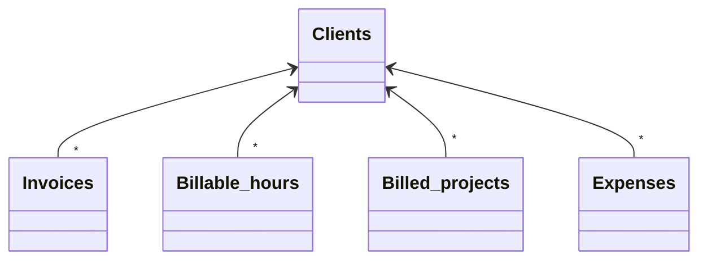

# Clients

[Open in Airtable](https://airtable.com/appAeUFSMOuOVDfCV/tblLdpbp52Mhjog08)

## Purpose
Single source of truth for every customer our consultancy serves. Stores contact details, default billing settings (hourly rate & currency), and high‑level financial roll‑ups (lifetime revenue, unpaid balance). Child records such as billable hours, invoices, projects and expenses all link here.

## Fields

| Field | Type | Key Options / Formula | Notes |
| ----- | ---- | --------------------- | ----- |
| **Client Name** | text (primary) | — | Primary display name. Keep it short for nicer concatenations in other tables. |
| **Email** | email | — | Used by automations to send invoices / hour logs. |
| **Phone** | phone | — | Optional. International format recommended. |
| **Address** | single‑line text | "Street × City × Country" all in one line. | Feeds AI extraction fields below. |
| **Hourly rate** | currency | Precision 0 | Default rate applied to new *Billable hours* entries via lookup. |
| **Currency** | single‑select ▫︎ EUR ▫︎ CZK ▫︎ USD | Pick the same currency as the hourly rate. | Critical for correct conversions downstream. |
| **Language** | single‑select ▫︎ English ▫︎ Czech | Drives email template language. | |
| **Billable Hours Email Notification** | checkbox | icon ✔︎ green | When checked, daily automation emails a summary of new hours to the client. |
| **Address line 1** | AI text | *Prompt*: "Extract Address Line 1 …" | Auto‑splits `Address`. Re‑run if the master address changes. |
| **Address line 2** | AI text | … returns empty if none. | Some countries rarely use this. |
| **City** | AI text | Separate prompts | Good for grouping / reporting by geography. |
| **State** | AI text | Separate prompts | State is blank in non‑federal countries. |
| **Country** | AI text | Separate prompts | Good for grouping / reporting by geography. |
| **Invoices** | link → [**Invoices**](https://airtable.com/appAeUFSMOuOVDfCV/tblTqyv2AcNTQJPje) | Multiple links | All invoices issued to the client. |
| **Billable hours** | link → [**Billable hours**](https://airtable.com/appAeUFSMOuOVDfCV/tblBhPqOGFIV86qsb) | Multiple links | Work logs to bill. |
| **Billed projects** | link → [**Billed projects**](https://airtable.com/appAeUFSMOuOVDfCV/tbl0oXRRiB7Fj1vEl) | Multiple links | Fixed‑price deliverables. |
| **Expenses** | link → [**Expenses**](https://airtable.com/appAeUFSMOuOVDfCV/tbl4rs8m2aGUcyH90) | Multiple links | Out‑of‑pocket costs to rebill or analyse profitability. |
| **Billable hours (total)** | rollup → Hours | Aggregation: `SUM(values)` as duration | |
| **Billable hours (unpaid)** | rollup | Filters to hours not linked to a *Paid* invoice | |
| **Projects (revenue) (total) (USD)** | rollup → *Price (USD)* | Already converted to USD in child table | |
| **Revenue (total) (USD)** | formula | `{Billable hours (revenue) (total) (USD)} + {Projects (revenue) (total) (USD)}` | Lifetime gross billings. |
| **To be paid (USD)** | formula | `{Billable hours (unpaid) (USD)} + {Projects (unpaid) (USD)}` | Outstanding balance visible to AM team. |
| **Logo** | attachment | — | Add client logo once; mail‑merge uses it on invoice PDFs. |

## Relationships

- **[Invoices](https://airtable.com/appAeUFSMOuOVDfCV/tblTqyv2AcNTQJPje)** (linked via *Invoices*)
- **[Billable hours](https://airtable.com/appAeUFSMOuOVDfCV/tblBhPqOGFIV86qsb)** (linked via *Billable hours*)
- **[Expenses](https://airtable.com/appAeUFSMOuOVDfCV/tbl4rs8m2aGUcyH90)** (linked via *Expenses*)
- **[Billed projects](https://airtable.com/appAeUFSMOuOVDfCV/tbl0oXRRiB7Fj1vEl)** (linked via *Billed projects*)

## Gotchas

* **Currency & hourly rate are *snap‑shot* values** – When you change them, existing *Billable hours* keep the old values (they store copies in their own fields). Update hours manually if needed.
* If you edit the **Address**, remember to re‑run the AI fields (or delete & undo) so the split parts refresh.
* Checking **Billable Hours Email Notification** without a valid email will cause automation failures.
* Roll‑up totals update instantly on Airtable Pro; on free plans they may lag a minute – don't panic.
* Large logos slow down invoice PDF render; aim for < 200 KB SVG/PNG.

## Calculated & AI fields
The **Address line 1**, **Address line 2**, **City**, **State**, and **Country** fields use AI text extraction to automatically parse the master **Address** field into structured components. The **Revenue (total) (USD)** and **To be paid (USD)** fields provide real-time financial summaries by combining rollup data from linked billable hours and projects.