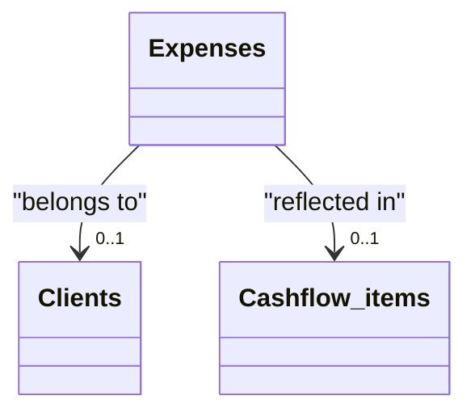

# Expenses

[Open in Airtable](https://airtable.com/appAeUFSMOuOVDfCV/tbl4rs8m2aGUcyH90)

## Purpose
Captures every company out‑of‑pocket cost—receipts, subscriptions, travel, services—so we can track profitability by client and feed monthly cash‑flow projections.

## Fields

| Field | Type | Key Options / Formula | Notes |
| ----- | ---- | --------------------- | ----- |
| **Expense ID** | text (primary) | Manual; suggest `YYYYMMDD‑vendor‑seq` | Human‑readable slug that appears on the PDF receipt link. |
| **Date** | date | Format `l` | Use receipt / invoice date, not payment date. |
| **Amount** | currency | Precision 2 | Enter **positive** value; cash‑flow layer flips sign. |
| **Category** | single‑select ▫︎ Office Supplies ▫︎ Travel ▫︎ Meals ▫︎ Utilities ▫︎ Miscellaneous ▫︎ Services | Expand list as needed for reporting granularity. | |
| **Attachments** | files | Upload PDF or photo of receipt; name files sensibly. | |
| **Client** | link → [**Clients**](https://airtable.com/appAeUFSMOuOVDfCV/tblLdpbp52Mhjog08) | Single link | Tag expense to a customer for pass‑through or margin analysis. Optional. |
| **Cashflow items** | link → [**Cashflow items**](https://airtable.com/appAeUFSMOuOVDfCV/tblZhFXFFYHJsmCVn) | Multiple links | Created automatically via script; amount comes in as **negative** for cash analysis. |

## Relationships

- **[Clients](https://airtable.com/appAeUFSMOuOVDfCV/tblLdpbp52Mhjog08)** (linked via *Client*)
- **[Cashflow items](https://airtable.com/appAeUFSMOuOVDfCV/tblZhFXFFYHJsmCVn)** (linked via *Cashflow items*)

## Gotchas

* **Always attach the receipt**—auditors & VAT reclaim need backup.
* **Positive vs negative**: keep *Amount* positive; downstream formula in Cashflow items multiplies by ‑1 so expenses appear as outflows.
* **Categorise consistently**; dashboards rely on Category for cost‑centre charts. Create new options sparingly.
* **Client link is optional**: Link only if the cost is project‑specific; leave blank for overheads.
* **Duplicate check**: When importing bank CSV, filter on *Expense ID* or *Date + Amount* to avoid double‑entry.
* Large file uploads (>5 MB) slow sync—compress images before attaching.

## Calculated & AI fields
The **Cashflow items** linkage automatically creates negative cash flow entries for expense tracking, ensuring accurate financial projections. The **Category** field enables automated cost analysis and reporting across different business functions.