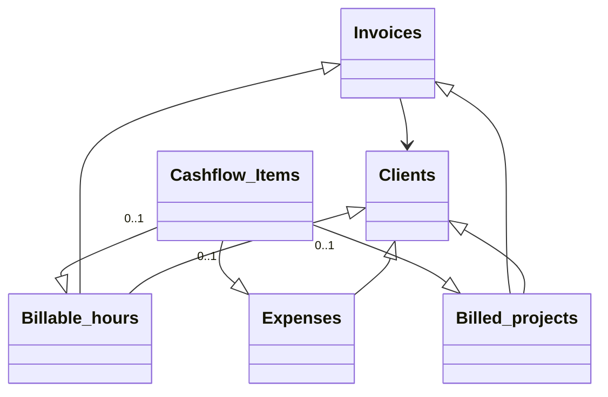

# Invoicing Airtable Base

This Airtable base simplifies client billing, invoicing, expense tracking, and cash‑flow reporting in one place:

* **Automatic syncing** of hourly rates, currencies, and client links across tables.
* **One‑click invoicing** that gathers unbilled hours and projects into a draft invoice.
* **Real‑time cash‑flow view** showing what’s been billed, paid, or outstanding.
* **Client portal** which allows clients to see project status and current and past invoices

Use this setup to cut repetitive data entry, avoid mistakes, and instantly see your income and costs by client.

## Tables and their relationships

