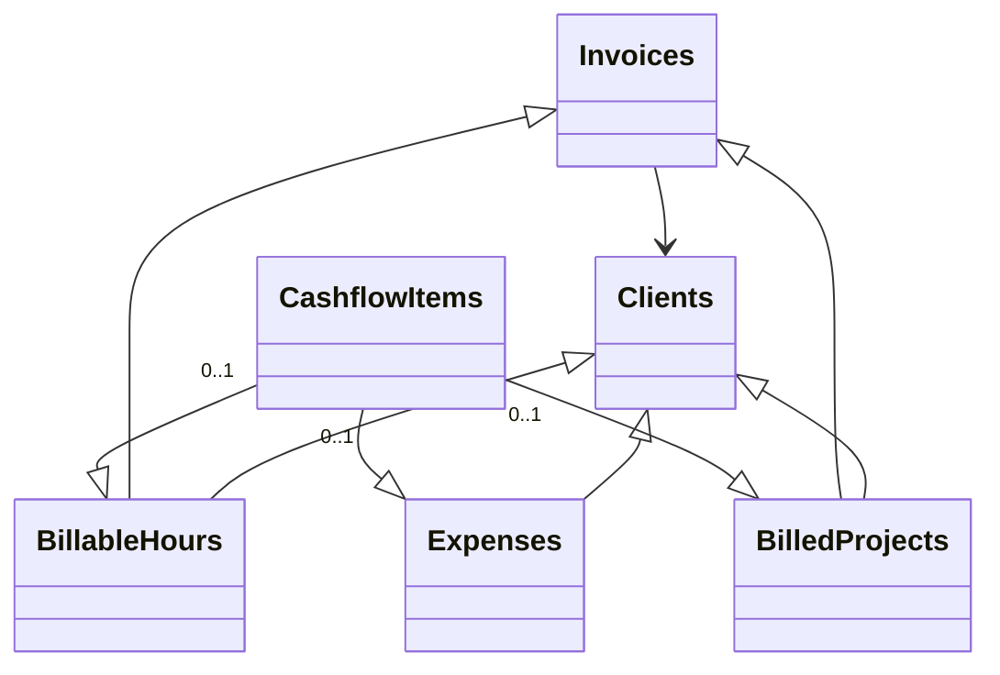

# Invoicing Airtable Base

This Airtable base simplifies client billing, invoicing, expense tracking, and cash‑flow reporting in one place:

* **Automatic syncing** of hourly rates, currencies, and client links across tables.
* **One‑click invoicing** that gathers unbilled hours and projects into a draft invoice.
* **Real‑time cash‑flow view** showing what’s been billed, paid, or outstanding.

Use this setup to cut repetitive data entry, avoid mistakes, and instantly see your income and costs by client.

## Base tables and their relationships

