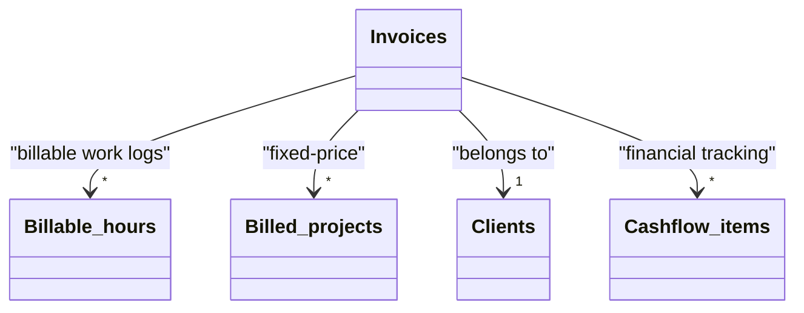

# Invoices

[Open in Airtable](https://airtable.com/appAeUFSMOuOVDfCV/tblTqyv2AcNTQJPje)

## Purpose
Central ledger of every invoice issued to clients. It aggregates billable hours & fixed‑price projects, tracks status (Draft → Sent → Paid/Overdue), and drives cash‑flow forecasting.

## Fields

| Field | Type | Key Options / Formula | Notes |
| ----- | ---- | --------------------- | ----- |
| **Invoice** | formula | `DATESTR({Issue Date}) & ' – ' & {Client}` | Primary field. Combines date + client name → stable human slug. |
| **Client** | link → [**Clients**](https://airtable.com/appAeUFSMOuOVDfCV/tblLdpbp52Mhjog08) | Single link, inverse field *Invoices* | Choosing a client auto‑pulls currency & hourly rate to linked hours/projects. |
| **Issue Date** | date | Format: local `l` | Drives payment terms & overdue flagging. |
| **Status** | single‑select ▫︎ Draft ▫︎ Sent ▫︎ Paid ▫︎ Overdue | Use automations to set Overdue when Sent > 30 d and not Paid. | Controls invoice lifecycle and payment tracking. |
| **Total** | formula | `{Billable hours (total)} + {Projects (total)}` | Sum of rolled‑up subtotals; currency shown separately. |
| **Currency** | formula → single‑select | If billable‑hours currency exists → use it else project's. | Ensures mixed totals are rejected. |
| **Billable hours** | link → [**Billable hours**](https://airtable.com/appAeUFSMOuOVDfCV/tblBhPqOGFIV86qsb) | Multiple links | Attach any work‑log entries to be billed on this invoice. |
| **Billed projects** | link → [**Billed projects**](https://airtable.com/appAeUFSMOuOVDfCV/tbl0oXRRiB7Fj1vEl) | Multiple links | Attach fixed‑price deliverables. |
| **Billable hours (total)** | rollup | Rollup → *Hours* field, aggregation `SUM(values)` | Aggregates total billable amount from linked hours. |
| **Projects (total)** | rollup | Rollup → *Price* field, aggregation `SUM(values)` | Aggregates total amount from linked projects. |
| **Currency (billable hours)** | lookup | Lookup from linked billable hours | Feeds main Currency formula for consistency checking. |
| **Currency (projects)** | lookup | Lookup from linked projects | Feeds main Currency formula for consistency checking. |
| **Cashflow items** | link → [**Cashflow items**](https://airtable.com/appAeUFSMOuOVDfCV/tblCashflowItems) | Multiple links | Links to corresponding cashflow entries for reporting. |

## Relationships

- **[Clients](https://airtable.com/appAeUFSMOuOVDfCV/tblLdpbp52Mhjog08)** (linked via *Client*)
- **[Billable hours](https://airtable.com/appAeUFSMOuOVDfCV/tblBhPqOGFIV86qsb)** (linked via *Billable hours*)
- **[Billed projects](https://airtable.com/appAeUFSMOuOVDfCV/tbl0oXRRiB7Fj1vEl)** (linked via *Billed projects*)
- **[Cashflow items](https://airtable.com/appAeUFSMOuOVDfCV/tblCashflowItems)** (linked via *Cashflow items*)

## Gotchas

* Always set **Client** first → populates hourly‑rate via lookup.
* Keep **Currency** consistent across linked hours/projects; mixed currencies will break totals.
* Remember to move **Status** from *Draft* → *Sent* when dispatching the PDF; an automation can email the client & update status.
* The **Total** formula ignores negative expenses; expenses are captured in *Cashflow items* instead.
* Deleting an invoice **does not** delete linked hours/projects, they just become unbilled again.
* **Issue Date** should be set before linking billable hours to ensure proper chronological ordering.
* Use the **Status** field consistently to enable accurate cash flow forecasting and overdue tracking.

## Calculated & AI fields
The **Invoice** primary field automatically generates a human-readable identifier combining the issue date and client name. The **Total** field dynamically calculates the sum of all linked billable hours and project amounts, while the **Currency** field ensures consistency across all monetary values to prevent calculation errors.